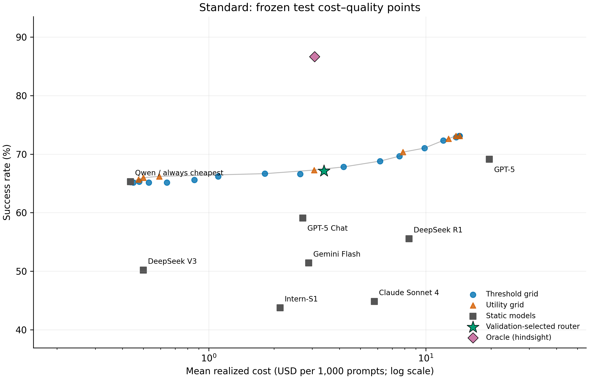
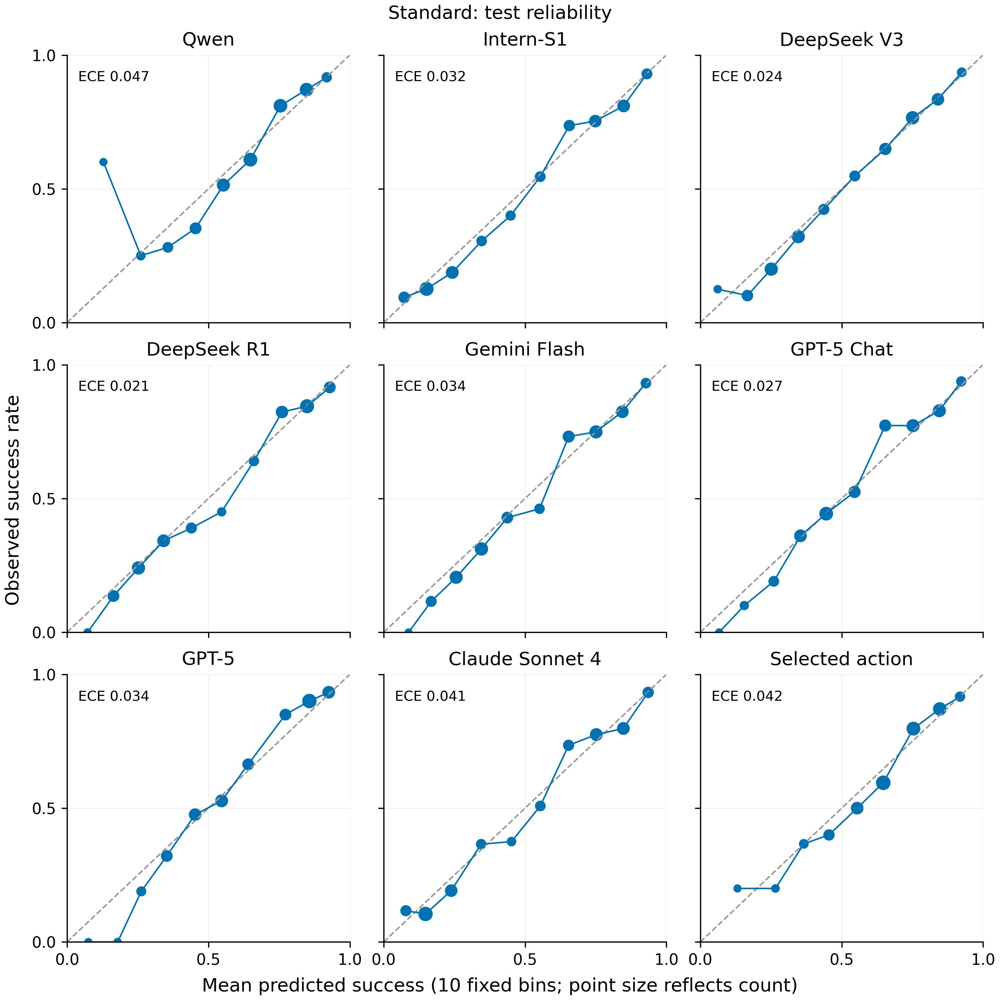
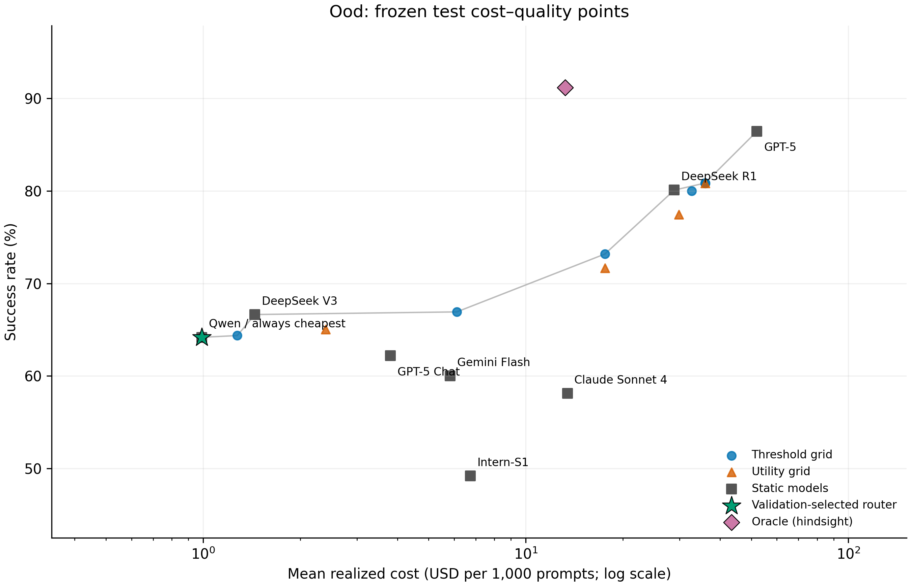
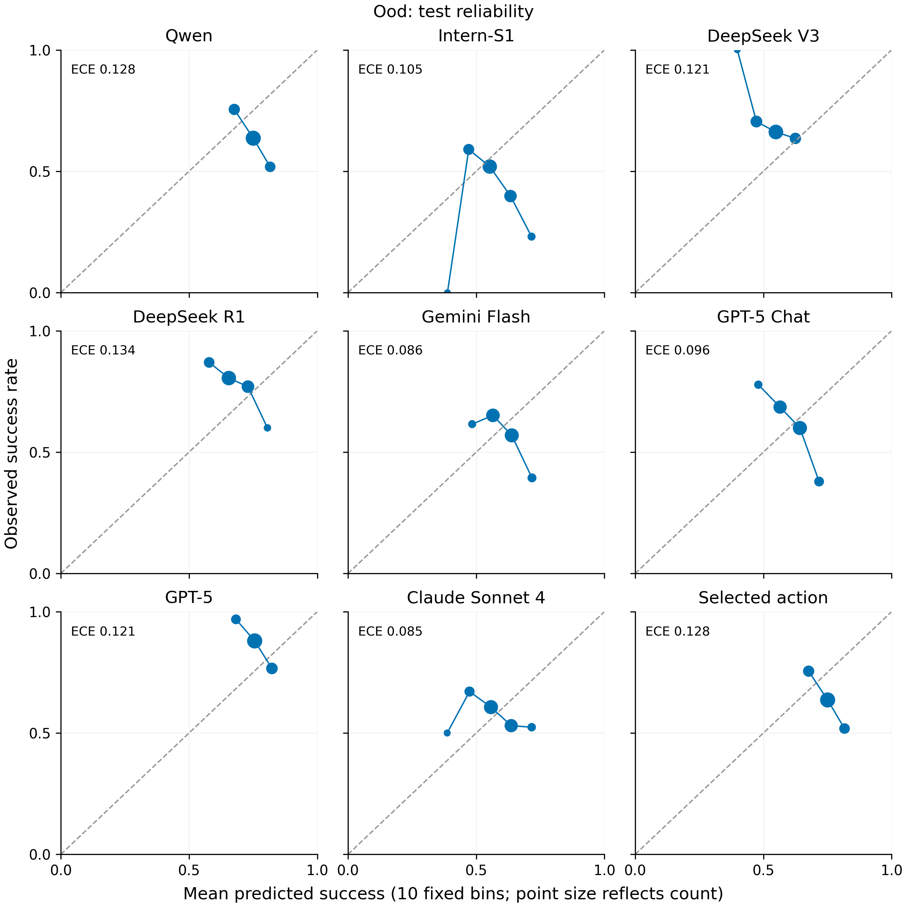

# Router v1: first learned routing experiment

TF-IDF routing did not establish a meaningful cost reduction at statistically preserved best-single quality.

The deployable policy was selected on validation and frozen before test evaluation. All costs are recorded benchmark USD per prompt; these are historical candidate configurations, not current API pricing. No paid calls, embeddings, dataset changes, or provider changes were made.

## Standard test

Selected C = **1**; deployable policy = **threshold_0.60**; best-single = **gpt-5**; test N = 1,305.

| Policy | Micro quality | Mean cost (USD) | Macro quality | Macro mean cost |
| --- | --- | --- | --- | --- |
| Best single | 69.119% | $0.01963688 | 84.724% | $0.03875472 |
| Learned router | 67.126% | $0.00339700 | 69.122% | $0.00410022 |
| Always cheapest | 65.287% | $0.00043555 | 67.854% | $0.00144953 |
| Oracle (hindsight) | 86.667% | $0.00307040 | 91.684% | $0.00839417 |

Cost savings: **82.701%**, 95% CI [79.994%, 85.116%]. Quality delta: **-1.992 percentage points**, 95% CI [-4.444, +0.383] pp.

Noninferiority supported (lower 95% quality-difference CI ≥ −0.5 pp): **no**. Do not call quality preserved.

Validation best-single quality 67.865%; chosen-policy quality 68.018%, cost $0.00355592; feasibility target 67.365%.

Oracle gap recovered: -11.354%; remaining quality gap to oracle: 19.540 pp. Oracle cost includes the training-cheapest fallback on unsolved prompts. Oracle cost conditional on solvable prompts: $0.00349113. This hindsight reference is not an achievable router.

Macro quality delta -15.601 pp, 95% CI [-22.317, -9.509]; macro cost savings 89.420%.

### Dataset results

| Dataset | N | Router Q | Best Q | Δ pp | Router cost | Best cost | Cheapest Q | Oracle Q |
| --- | --- | --- | --- | --- | --- | --- | --- | --- |
| AIME | 8 | 75.000% | 100.000% | -25.000 | $0.0045186 | $0.0785372 | 75.000% | 100.000% |
| GPQA | 30 | 53.333% | 86.667% | -33.333 | $0.0026524 | $0.0430183 | 53.333% | 90.000% |
| LiveCodeBench | 158 | 63.291% | 89.873% | -26.582 | $0.0112875 | $0.0538996 | 58.228% | 91.772% |
| LiveMathBench | 17 | 82.353% | 94.118% | -11.765 | $0.0020697 | $0.0301944 | 82.353% | 94.118% |
| MMLU-Pro | 447 | 84.787% | 89.933% | -5.145 | $0.0006487 | $0.0134295 | 84.564% | 95.302% |
| SimpleQA | 645 | 55.969% | 47.752% | +8.217 | $0.0034245 | $0.0134494 | 53.643% | 78.915% |

### Classifier diagnostics (test)

PR AUC is average precision (step-integrated PR); trapezoidal PR AUC is also saved. Accuracy uses p ≥ 0.5. Macro here averages the eight predictors; dataset macro above averages datasets. Calibration uses ten fixed equal-width bins and log-loss clipping at 1e−6. Undefined single-class AUC is null.

| Predictor | Prevalence | ROC AUC | PR AUC | Log loss | Brier | ECE | Accuracy |
| --- | --- | --- | --- | --- | --- | --- | --- |
| Qwen | 65.287% | 0.7463 | 0.8358 | 0.5627 | 0.1905 | 0.0470 | 71.034% |
| Intern-S1 | 43.755% | 0.8491 | 0.8004 | 0.4736 | 0.1507 | 0.0318 | 80.153% |
| DeepSeek V3 | 50.192% | 0.7990 | 0.7868 | 0.5465 | 0.1823 | 0.0242 | 74.406% |
| DeepSeek R1 | 55.556% | 0.8294 | 0.8462 | 0.4986 | 0.1619 | 0.0206 | 78.008% |
| Gemini Flash | 51.418% | 0.7992 | 0.7961 | 0.5442 | 0.1813 | 0.0338 | 74.406% |
| GPT-5 Chat | 59.080% | 0.7549 | 0.8049 | 0.5731 | 0.1950 | 0.0267 | 69.962% |
| GPT-5 | 69.119% | 0.8006 | 0.8903 | 0.4869 | 0.1597 | 0.0338 | 75.326% |
| Claude Sonnet 4 | 44.828% | 0.8612 | 0.8205 | 0.4570 | 0.1443 | 0.0409 | 80.996% |
| Predictor macro | 54.904% | 0.8050 | 0.8226 | 0.5178 | 0.1707 | 0.0323 | 75.536% |
| Selected action | 67.126% | 0.7224 | 0.8332 | 0.5669 | 0.1927 | 0.0422 | 69.808% |

### Selected-model behavior

| Model | N | Routed | Predicted success | Actual success | Realized mean cost |
| --- | --- | --- | --- | --- | --- |
| Qwen | 1057 | 80.996% | 70.975% | 71.334% | $0.00044596 |
| Intern-S1 | 4 | 0.307% | 67.573% | 50.000% | $0.00277816 |
| DeepSeek V3 | 26 | 1.992% | 64.051% | 50.000% | $0.00175359 |
| DeepSeek R1 | 31 | 2.375% | 67.140% | 51.613% | $0.03884859 |
| Gemini Flash | 4 | 0.307% | 42.522% | 25.000% | $0.00008300 |
| GPT-5 Chat | 17 | 1.303% | 51.106% | 52.941% | $0.00047449 |
| GPT-5 | 165 | 12.644% | 55.131% | 49.091% | $0.01626941 |
| Claude Sonnet 4 | 1 | 0.077% | 70.236% | 0.000% | $0.00784500 |

| Dataset | Qwen | Intern-S1 | DeepSeek V3 | DeepSeek R1 | Gemini Flash | GPT-5 Chat | GPT-5 | Claude Sonnet 4 |
| --- | --- | --- | --- | --- | --- | --- | --- | --- |
| AIME | 8 | 0 | 0 | 0 | 0 | 0 | 0 | 0 |
| GPQA | 26 | 1 | 1 | 2 | 0 | 0 | 0 | 0 |
| LiveCodeBench | 106 | 0 | 20 | 27 | 0 | 0 | 5 | 0 |
| LiveMathBench | 17 | 0 | 0 | 0 | 0 | 0 | 0 | 0 |
| MMLU-Pro | 441 | 3 | 2 | 0 | 0 | 0 | 0 | 1 |
| SimpleQA | 459 | 0 | 3 | 2 | 4 | 17 | 160 | 0 |

### Pareto frontier and descriptive envelopes

The deployable frontier includes the frozen grids and static models. The oracle is shown separately; a second frontier including it is saved. Identical points may have multiple policy IDs. Test envelopes describe this frozen grid and never replace the validation choice.

| Nondominated policy | Quality | Mean cost |
| --- | --- | --- |
| always_cheapest | 65.287% | $0.00043555 |
| static_qwen3-235b-a22b-2507 | 65.287% | $0.00043555 |
| threshold_0.00 | 65.287% | $0.00043555 |
| threshold_0.05 | 65.287% | $0.00043555 |
| threshold_0.10 | 65.287% | $0.00043555 |
| utility_10 | 65.670% | $0.00047455 |
| utility_3 | 65.977% | $0.00049935 |
| utility_1 | 66.207% | $0.00059192 |
| threshold_0.50 | 66.667% | $0.00181517 |
| utility_0.3 | 67.280% | $0.00305618 |
| threshold_0.65 | 67.816% | $0.00418371 |
| threshold_0.70 | 68.812% | $0.00615613 |
| threshold_0.75 | 69.655% | $0.00756947 |
| utility_0.1 | 70.345% | $0.00785550 |
| threshold_0.80 | 71.034% | $0.00986291 |
| threshold_0.85 | 72.337% | $0.01203547 |
| utility_0.03 | 72.644% | $0.01271785 |
| utility_0.01 | 73.103% | $0.01375874 |

| Test-envelope tolerance | Feasible | Policy | Savings |
| --- | --- | --- | --- |
| 0.5 pp | True | threshold_0.70 | 68.650% |
| 0.0 pp | True | threshold_0.75 | 61.453% |

| Budget / train best cost | Budget USD | Descriptive gain pp | Validation choice | Test budget violation |
| --- | --- | --- | --- | --- |
| 0.25 | $0.004682 | +2.529 | threshold_0.65 | False |
| 0.5 | $0.009364 | +5.057 | threshold_0.80 | True |
| 0.75 | $0.014046 | +7.816 | threshold_0.95 | True |
| 1.0 | $0.018727 | +7.816 | threshold_0.95 | False |





## Independent OOD test

Selected C = **1**; deployable policy = **utility_10**; best-single = **gpt-5**; test N = 1,055.

| Policy | Micro quality | Mean cost (USD) | Macro quality | Macro mean cost |
| --- | --- | --- | --- | --- |
| Best single | 86.445% | $0.05205347 | 86.445% | $0.05205347 |
| Learned router | 64.171% | $0.00098984 | 64.171% | $0.00098984 |
| Always cheapest | 64.171% | $0.00098984 | 64.171% | $0.00098984 |
| Oracle (hindsight) | 91.185% | $0.01323996 | 91.185% | $0.01323996 |

Cost savings: **98.098%**, 95% CI [97.946%, 98.239%]. Quality delta: **-22.275 percentage points**, 95% CI [-25.024, -19.526] pp.

Noninferiority supported (lower 95% quality-difference CI ≥ −0.5 pp): **no**. Do not call quality preserved.

Validation best-single quality 66.202%; chosen-policy quality 66.028%, cost $0.00033060; feasibility target 65.702%.

Oracle gap recovered: -470.000%; remaining quality gap to oracle: 27.014 pp. Oracle cost includes the training-cheapest fallback on unsolved prompts. Oracle cost conditional on solvable prompts: $0.01433509. This hindsight reference is not an achievable router.

Macro quality delta -22.275 pp, 95% CI [-25.024, -19.526]; macro cost savings 98.098%.

### Dataset results

| Dataset | N | Router Q | Best Q | Δ pp | Router cost | Best cost | Cheapest Q | Oracle Q |
| --- | --- | --- | --- | --- | --- | --- | --- | --- |
| LiveCodeBench | 1055 | 64.171% | 86.445% | -22.275 | $0.0009898 | $0.0520535 | 64.171% | 91.185% |

### Classifier diagnostics (test)

PR AUC is average precision (step-integrated PR); trapezoidal PR AUC is also saved. Accuracy uses p ≥ 0.5. Macro here averages the eight predictors; dataset macro above averages datasets. Calibration uses ten fixed equal-width bins and log-loss clipping at 1e−6. Undefined single-class AUC is null.

| Predictor | Prevalence | ROC AUC | PR AUC | Log loss | Brier | ECE | Accuracy |
| --- | --- | --- | --- | --- | --- | --- | --- |
| Qwen | 64.171% | 0.4060 | 0.5781 | 0.7031 | 0.2493 | 0.1280 | 64.171% |
| Intern-S1 | 49.194% | 0.4090 | 0.4262 | 0.7311 | 0.2683 | 0.1050 | 46.919% |
| DeepSeek V3 | 66.635% | 0.4675 | 0.6464 | 0.6779 | 0.2424 | 0.1207 | 58.389% |
| DeepSeek R1 | 80.095% | 0.4515 | 0.7842 | 0.5536 | 0.1825 | 0.1339 | 80.095% |
| Gemini Flash | 60.000% | 0.4291 | 0.5517 | 0.6909 | 0.2484 | 0.0855 | 59.716% |
| GPT-5 Chat | 62.180% | 0.3968 | 0.5507 | 0.6900 | 0.2477 | 0.0957 | 61.232% |
| GPT-5 | 86.445% | 0.3619 | 0.8101 | 0.4456 | 0.1337 | 0.1213 | 86.445% |
| Claude Sonnet 4 | 58.104% | 0.4314 | 0.5356 | 0.7007 | 0.2534 | 0.0849 | 55.450% |
| Predictor macro | 65.853% | 0.4192 | 0.6104 | 0.6491 | 0.2282 | 0.1094 | 64.052% |
| Selected action | 64.171% | 0.4060 | 0.5781 | 0.7031 | 0.2493 | 0.1280 | 64.171% |

### Selected-model behavior

| Model | N | Routed | Predicted success | Actual success | Realized mean cost |
| --- | --- | --- | --- | --- | --- |
| Qwen | 1055 | 100.000% | 74.606% | 64.171% | $0.00098984 |
| Intern-S1 | 0 | 0.000% | — | — | — |
| DeepSeek V3 | 0 | 0.000% | — | — | — |
| DeepSeek R1 | 0 | 0.000% | — | — | — |
| Gemini Flash | 0 | 0.000% | — | — | — |
| GPT-5 Chat | 0 | 0.000% | — | — | — |
| GPT-5 | 0 | 0.000% | — | — | — |
| Claude Sonnet 4 | 0 | 0.000% | — | — | — |

| Dataset | Qwen | Intern-S1 | DeepSeek V3 | DeepSeek R1 | Gemini Flash | GPT-5 Chat | GPT-5 | Claude Sonnet 4 |
| --- | --- | --- | --- | --- | --- | --- | --- | --- |
| LiveCodeBench | 1055 | 0 | 0 | 0 | 0 | 0 | 0 | 0 |

### Pareto frontier and descriptive envelopes

The deployable frontier includes the frozen grids and static models. The oracle is shown separately; a second frontier including it is saved. Identical points may have multiple policy IDs. Test envelopes describe this frozen grid and never replace the validation choice.

| Nondominated policy | Quality | Mean cost |
| --- | --- | --- |
| always_cheapest | 64.171% | $0.00098984 |
| deployable_router | 64.171% | $0.00098984 |
| static_qwen3-235b-a22b-2507 | 64.171% | $0.00098984 |
| threshold_0.00 | 64.171% | $0.00098984 |
| threshold_0.05 | 64.171% | $0.00098984 |
| threshold_0.10 | 64.171% | $0.00098984 |
| threshold_0.15 | 64.171% | $0.00098984 |
| threshold_0.20 | 64.171% | $0.00098984 |
| threshold_0.25 | 64.171% | $0.00098984 |
| threshold_0.30 | 64.171% | $0.00098984 |
| threshold_0.35 | 64.171% | $0.00098984 |
| threshold_0.40 | 64.171% | $0.00098984 |
| threshold_0.45 | 64.171% | $0.00098984 |
| threshold_0.50 | 64.171% | $0.00098984 |
| threshold_0.55 | 64.171% | $0.00098984 |
| threshold_0.60 | 64.171% | $0.00098984 |
| utility_0.3 | 64.171% | $0.00098984 |
| utility_1 | 64.171% | $0.00098984 |
| utility_10 | 64.171% | $0.00098984 |
| utility_3 | 64.171% | $0.00098984 |
| threshold_0.65 | 64.360% | $0.00127569 |
| static_deepseek-v3-0324 | 66.635% | $0.00144710 |
| threshold_0.70 | 66.919% | $0.00611270 |
| threshold_0.75 | 73.175% | $0.01758704 |
| static_deepseek-r1-0528 | 80.095% | $0.02887231 |
| threshold_0.85 | 80.853% | $0.03595634 |
| threshold_0.90 | 80.853% | $0.03595634 |
| threshold_0.95 | 80.853% | $0.03595634 |
| threshold_1.00 | 80.853% | $0.03595634 |
| utility_0 | 80.853% | $0.03595634 |
| best_single | 86.445% | $0.05205347 |
| static_gpt-5 | 86.445% | $0.05205347 |

| Test-envelope tolerance | Feasible | Policy | Savings |
| --- | --- | --- | --- |
| 0.5 pp | False | None | — |
| 0.0 pp | False | None | — |

| Budget / train best cost | Budget USD | Descriptive gain pp | Validation choice | Test budget violation |
| --- | --- | --- | --- | --- |
| 0.25 | $0.003546 | -1.611 | utility_0.1 | False |
| 0.5 | $0.007092 | +0.284 | utility_0.03 | True |
| 0.75 | $0.010638 | +0.284 | utility_0.01 | True |
| 1.0 | $0.014184 | +0.284 | utility_0.01 | True |





## Code-domain generalization

The standard router scored 63.291% on 158 standard LiveCodeBench test prompts; the independent OOD router scored 64.171% on all 1055 held-out code prompts: +0.879 pp. Mean cost changed from $0.01128747 to $0.00098984.

On the shared 158 prompts, the OOD router scored 58.228%, a -5.063 pp difference from the standard system. This shared-subset comparison is descriptive and did not tune either system.

These are independently trained systems with independently selected policies. The full-test comparison also changes the sample (158 versus 1,055); it is not a paired causal estimate of domain shift. OOD training and validation contain zero LiveCodeBench prompts. OOD macro equals micro because there is one test dataset.

## Exactly one ablation: 16 prompt features + logistic regression

The same feature family was evaluated in both regimes, with independent train-only standardization, the same C grid/folds, and the same validation policy selection. No dataset metadata enters these features.

| Regime / features | C | Policy | Quality | Cost | Savings | Δ pp | 95% Δ CI pp | Noninferiority |
| --- | --- | --- | --- | --- | --- | --- | --- | --- |
| standard / tfidf | 1.0 | threshold_0.60 | 67.126% | $0.00339700 | 82.701% | -1.992 | -4.444, +0.383 | False |
| standard / handcrafted | 0.1 | threshold_0.75 | 68.429% | $0.00552974 | 71.840% | -0.690 | -3.295, +1.839 | False |
| ood / tfidf | 1.0 | utility_10 | 64.171% | $0.00098984 | 98.098% | -22.275 | -25.024, -19.526 | False |
| ood / handcrafted | 0.1 | threshold_0.70 | 51.943% | $0.00634757 | 87.806% | -34.502 | -37.630, -31.374 | False |

## What the experiment supports

The primary standard policy fails the frozen noninferiority criterion. Good aggregate classifier AUC does not establish safe routing: predicting absolute success and selecting a cheaper model without losing quality are different evaluation questions.

The observed standard behavior is dominated by the cheapest model: Qwen receives all eight AIME and all 17 LiveMathBench test prompts, 441/447 MMLU-Pro prompts, and 106/158 code prompts. Only five code prompts go to GPT-5; 160 of GPT-5's 165 selections are SimpleQA. Thus the fitted policy does not exhibit the hoped-for pattern of reserving strong reasoning for hard math/code. These counts describe behavior, not a causal explanation of what individual words encode.

SimpleQA improves by 8.217 pp against GPT-5 while every other dataset loses quality. Equal-dataset macro quality falls by 15.601 pp (95% CI −22.317 to −9.509). The validation constraint uses the frozen micro objective; it can accept tradeoffs that harm minority domains. This is an observed limitation of this operating point, not grounds to alter the experiment after seeing test results.

There is descriptive routing signal in the frozen frontier. For example, the prespecified λ=0.01 point achieves 73.103% at $0.01375874, saving 29.934% against GPT-5. It was not the validation-selected primary policy. The primary τ=0.60 point is dominated on test by λ=0.3. Neither observation authorizes replacing the frozen winner or claiming test-selected deployment performance.

OOD selects utility_10 using non-code validation. Qwen receives 100.000% of code prompts; quality is -22.275 pp versus GPT-5. Full OOD quality changes by +0.879 pp from the standard code subset, while on the identical 158 prompts the change is -5.063 pp. OOD classifier macro ROC AUC is 0.419, showing poor code-domain discrimination.

Lexical features improve standard diagnostic log loss (0.5178 versus 0.5454 for handcrafted features) and ROC AUC (0.8050 versus 0.7724). Nevertheless, the handcrafted deployable point has higher test quality (68.429%) at higher cost ($0.00552974); neither achieves supported noninferiority. Lexical information helps prediction, but this experiment does not establish a superior deployable cost/quality tradeoff from it.

Recommendation for the next separately authorized ML experiment: compare frozen local embeddings plus the same eight logistic regressions under the unchanged split, tuning, routing and uncertainty protocol. The question is whether semantic features improve cross-domain success estimates beyond this lexical baseline. Keep domain macro results prominent and retain this failed primary result. Any later change to validation selection or quality constraints should be a separately preregistered experiment, not a rescue chosen from this test set. No embeddings or additional model families were run here.

## Protocol, uncertainty, and reproduction

Five StratifiedGroupKFold folds use dataset strata and leakage groups inside training (shuffle=True, seed 3407). With eight binary targets there is no single target class to stratify on; dataset strata preserve the frozen protocol's domain mixture. Each fold fits its own TF-IDF vocabulary or scaler; the mean of 40 fold/model log losses chooses the shared C, ties toward smaller C. Final fits use training only. Raw probabilities are used without calibration fitting. All 21 thresholds and eight utilities are fixed by the original spec.

The 2,000-replicate paired bootstrap resamples whole prompt groups with replacement within datasets, using seed 3407. Percentile 95% intervals condition on fixed training and validation selection; they do not quantify training-seed or model-selection uncertainty. Small math/science test strata limit domain-specific conclusions. MMLU-Pro and SimpleQA dominate micro averages. This is the previously inspected, frozen exploratory split, not a new external confirmation dataset.

A complete second standard TF-IDF training/CV pass checks deterministic folds, hyperparameter choice, preprocessing, coefficients and training probabilities before test is opened. Saved model reloads must reproduce training probabilities exactly. Fresh models, vocabularies/scalers, CV, costs and validation choices are fitted for OOD. Package versions, source/spec/code hashes, candidate order, folds and signatures are in each metadata.json. The processed inputs are hash-checked before and after each run.

| Run | Training seconds | Replay seconds | Test prediction ms/prompt | Test routing ms/prompt | Vocabulary |
| --- | --- | --- | --- | --- | --- |
| standard_tfidf | 6.52 | 6.76 | 0.0551 | 0.0003 | 43074 |
| standard_handcrafted | 0.96 | 0.00 | 0.0006 | 0.0002 | None |
| ood_tfidf | 5.04 | 0.00 | 0.1222 | 0.0001 | 39450 |
| ood_handcrafted | 1.11 | 0.00 | 0.0008 | 0.0003 | None |

Measured batch CPU timing is local compute overhead, not an API charge or online latency benchmark. Timing/environment files may differ across runs; numerical tables and model signatures are deterministic in the pinned environment.

```bash
.venv/bin/python -m pip install -r experiments/requirements-router-v1.txt
.venv/bin/python experiments/tfidf_logreg_router.py
.venv/bin/python tests/run_offline_suite.py
```

The command uses existing frozen processed artifacts and runs standard TF-IDF, OOD TF-IDF, standard handcrafted, then OOD handcrafted. To run only the first stage: `--regime standard --features tfidf`. The OOD stage requires a completed deterministic standard result. Large reproducible files under `artifacts/router_v1/` are git-ignored; small reports/JSON/figures are retained.

Saved per-run artifacts: `models.joblib`, `metadata.json`, `cv_scores.parquet`, `cv_assignments.parquet`, `train_predictions.parquet`, `validation_predictions.parquet`, `test_predictions.parquet`, `validation_policy_grid.parquet`, `frozen_policy.json`, `{validation,test}_routing_decisions.parquet`, `{validation,test}_evaluation.parquet`, `{validation,test}_policy_metrics.parquet`, `static_model_summary.parquet`, `classifier_metrics.parquet`, `reliability.parquet`, `pareto_table.parquet`, `selection_distribution.parquet`, `dataset_selection_counts.parquet`, `bootstrap_samples.parquet`, `results.json`, and `artifact_hashes.json`. Prediction and routing-decision tables contain no outcomes. Separate evaluation artifacts contain selected labels/costs; original labels remain in the frozen source.

The pinned NumPy/macOS dense BLAS path emitted divide-by-zero/overflow/invalid flags on finite handcrafted matrices. An independent non-BLAS einsum + sigmoid calculation matched every saved train/validation/test probability to within 2.3e−16, and both handcrafted training/CV replays were exact. The implementation retains sklearn probabilities and checks the independent reference before consuming these warnings; nonfinite or disagreeing probabilities fail. No policies or test outcomes changed. See [numerical verification](router_v1_numerical_audit.json).

## Tests and files

Full offline suite: **187 tests, 0 failures, 0 errors, 0 skipped**; 0 network attempts with networking blocked. Includes every existing test, synthetic leakage/decision/bootstrap checks, and independent scalar verification of all frozen-grid routing decisions against the actual saved predictions. [Test summary](router_v1_tests.json).

Added `experiments/tfidf_logreg_router.py`, `experiments/requirements-router-v1.txt`, `routing_ml/{training,policies,metrics,bootstrap,reporting}.py`, `routing_ml/__init__.py`, `tests/test_router_v1.py`, `tests/test_router_v1_artifacts.py`, result/verification reports, and PNG/PDF figures. Updated `README.md` and `.gitignore`. Frozen preprocessing, experiment spec, provider code, and source processed data are unchanged.
