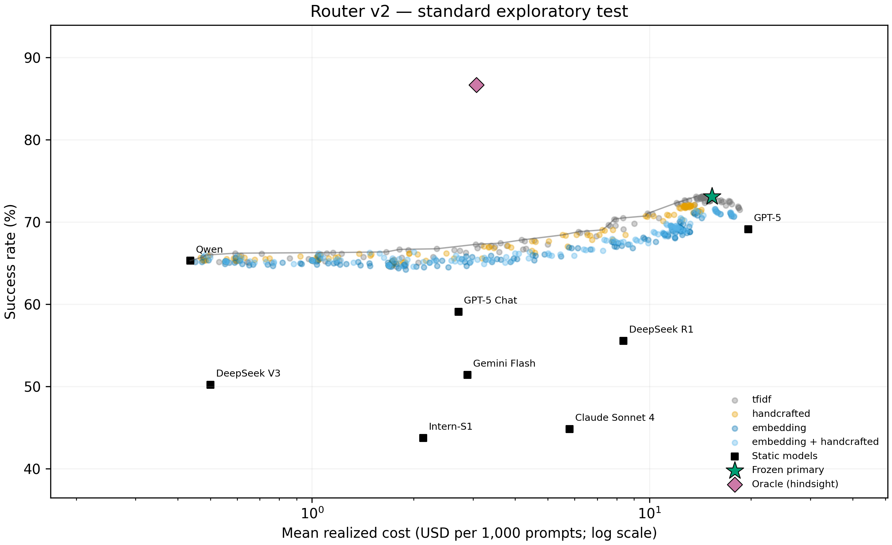
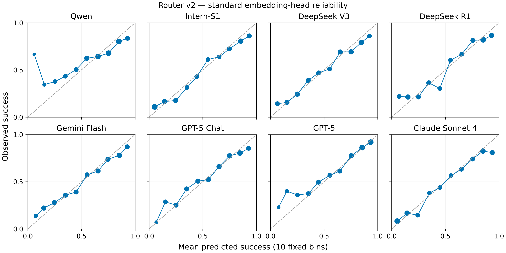
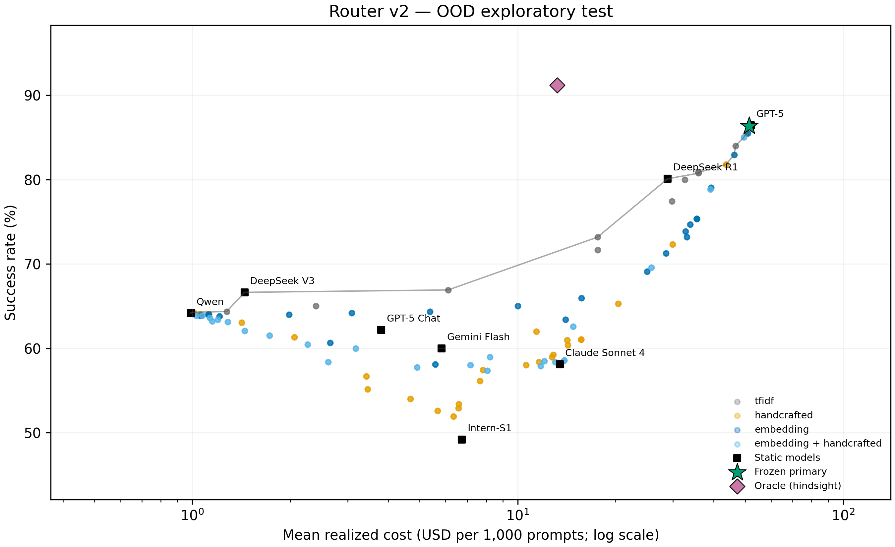
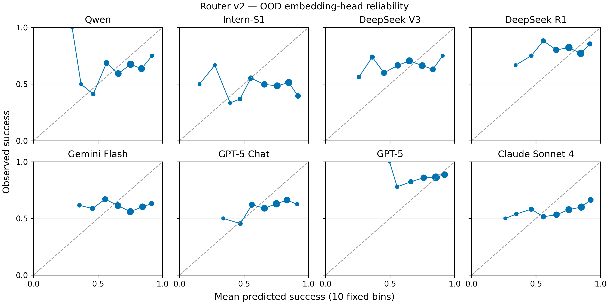

# Router v2: local semantic features and conservative routing

The frozen v2 standard router does not meet all four preregistered exploratory criteria. The failed conditions are reported below; no test policy replaces the validation choice.

Standard primary: **73.103% success**, **$0.01530374/prompt**, **22.066% savings**, quality change **+3.985 pp** versus validation-selected best-single.

These are **exploratory results on already-inspected benchmark tests**, not fresh external confirmation. The v2 protocol was written before supervised v2 fitting; representation, C, policy and novelty choices use training/validation only. All v1 results remain unchanged. [Frozen v2 protocol](router_v2_experiment_spec.md).

The immutable local encoder is [BAAI/bge-small-en-v1.5](https://huggingface.co/BAAI/bge-small-en-v1.5), revision `5c38ec7c405ec4b44b94cc5a9bb96e735b38267a`. It produces 384-dimensional vectors. Long prompts are encoded in complete 510-content-token chunks and combined by a token-weighted mean. No prompt is truncated; no response, label, cost or dataset identifier enters encoder input. The frozen encoder/cache is shared across regimes, while every learned head, scaler, cost estimate and novelty reference set is independent.

## Standard test

N=1,305; frozen candidate **`tfidf__advantage_0.02__gate_0.00`**. Best-single **gpt-5**, selected from validation.

| Policy | Success | Mean cost USD |
| --- | --- | --- |
| Frozen primary | 73.103% | $0.01530374 |
| Best single | 69.119% | $0.01963688 |
| Always cheapest | 65.287% | $0.00043555 |
| Oracle (hindsight) | 86.667% | $0.00307040 |

Quality difference +3.985 pp; 95% paired CI [+2.069, +5.824] pp. Cost savings 22.066%; 95% CI [19.691%, 24.688%].

Equal-dataset macro quality 85.988%; macro difference +1.264 pp, CI [+0.586, +1.901] pp. Oracle gap recovered 22.707%; remaining gap 13.563 pp. Oracle uses hindsight success and realized costs, with a charged training-cheapest fallback when unsolved; it is not attainable deployment performance.

| Preregistered condition | Pass |
| --- | --- |
| dataset point guard | False |
| macro noninferiority | True |
| micro noninferiority | True |
| savings at least 10 percent | True |

Primary is on the descriptive test Pareto frontier: **False**. Novelty gate rejection rate: **0.000%**. Rejected prompts use best-single; zero savings from a static fallback do not count as routing value.

### Validation selection audit

Joint max-t critical value 4.0361; 28 feasible deployment IDs out of 545. The bootstrap includes 4360 candidate/anchor definitions before action deduplication, all eight static comparators, and both micro/macro metrics.

| Selected policy on validation | Value |
| --- | --- |
| quality | 0.7268553940321346 |
| mean_cost_usd | 0.013922609781943363 |
| micro_delta | 0.04820198928844677 |
| macro_delta | 0.01707552415530056 |
| micro_lower | 0.009465382194763151 |
| macro_lower | 0.00333053650515084 |
| worst_dataset_delta | 0.0 |

### Dataset outcomes

| Dataset | N | Primary | Best single | Δ pp | Primary cost | Best cost |
| --- | --- | --- | --- | --- | --- | --- |
| AIME | 8 | 100.000% | 100.000% | +0.000 | $0.07853719 | $0.07853719 |
| GPQA | 30 | 86.667% | 86.667% | +0.000 | $0.03995818 | $0.04301825 |
| LiveCodeBench | 158 | 89.241% | 89.873% | -0.633 | $0.05397840 | $0.05389961 |
| LiveMathBench | 17 | 94.118% | 94.118% | +0.000 | $0.03019441 | $0.03019441 |
| MMLU-Pro | 447 | 89.933% | 89.933% | +0.000 | $0.01308923 | $0.01342948 |
| SimpleQA | 645 | 55.969% | 47.752% | +8.217 | $0.00504117 | $0.01344939 |

### Representation controls

Each control uses the original v1 minimum-cost validation selector over its 29 ungated policies. These isolate feature changes; none can replace the primary using test performance.

| Features | C | Control policy | Quality | Cost USD | Savings | Δ pp | 95% Δ CI pp |
| --- | --- | --- | --- | --- | --- | --- | --- |
| tfidf | 1.0 | threshold_0.60 | 67.126% | $0.00339700 | 82.701% | -1.992 | -4.444, +0.383 |
| handcrafted | 0.1 | threshold_0.75 | 68.429% | $0.00552974 | 71.840% | -0.690 | -3.295, +1.839 |
| embedding | 0.1 | utility_0.1 | 67.050% | $0.00788493 | 59.846% | -2.069 | -4.598, +0.385 |
| embedding_handcrafted | 0.1 | utility_0.1 | 67.816% | $0.00734601 | 62.591% | -1.303 | -3.908, +1.149 |

### Classifier diagnostics

Macro below means an equal average over eight predictors, not dataset macro. PR AUC is average precision; accuracy uses p ≥ 0.5. Full per-model/train/validation/test and reliability tables are saved separately.

| Features | ROC AUC | PR AUC | Log loss | Brier | ECE | Accuracy |
| --- | --- | --- | --- | --- | --- | --- |
| tfidf | 0.8050 | 0.8226 | 0.5178 | 0.1707 | 0.0323 | 0.7554 |
| handcrafted | 0.7724 | 0.7973 | 0.5454 | 0.1821 | 0.0239 | 0.7293 |
| embedding | 0.7754 | 0.7866 | 0.5563 | 0.1846 | 0.0460 | 0.7339 |
| embedding_handcrafted | 0.7788 | 0.7940 | 0.5537 | 0.1837 | 0.0468 | 0.7334 |

### Selected-model behavior

| Model | Count | Routed | Mean prediction | Actual success | Cost USD |
| --- | --- | --- | --- | --- | --- |
| Qwen | 406 | 31.111% | 60.834% | 59.360% | $0.00005409 |
| Intern-S1 | 6 | 0.460% | 88.239% | 83.333% | $0.00105540 |
| DeepSeek V3 | 0 | 0.000% | — | — | — |
| DeepSeek R1 | 17 | 1.303% | 83.350% | 82.353% | $0.01027842 |
| Gemini Flash | 4 | 0.307% | 64.282% | 25.000% | $0.00133150 |
| GPT-5 Chat | 6 | 0.460% | 45.511% | 50.000% | $0.00058188 |
| GPT-5 | 856 | 65.594% | 77.916% | 79.556% | $0.02299552 |
| Claude Sonnet 4 | 10 | 0.766% | 92.254% | 90.000% | $0.00753690 |

| Dataset | Qwen | Intern-S1 | DeepSeek V3 | DeepSeek R1 | Gemini Flash | GPT-5 Chat | GPT-5 | Claude Sonnet 4 |
| --- | --- | --- | --- | --- | --- | --- | --- | --- |
| AIME | 0 | 0 | 0 | 0 | 0 | 0 | 8 | 0 |
| GPQA | 0 | 0 | 0 | 3 | 0 | 0 | 27 | 0 |
| LiveCodeBench | 0 | 0 | 0 | 3 | 0 | 0 | 155 | 0 |
| LiveMathBench | 0 | 0 | 0 | 0 | 0 | 0 | 17 | 0 |
| MMLU-Pro | 5 | 6 | 0 | 10 | 3 | 0 | 413 | 10 |
| SimpleQA | 401 | 0 | 0 | 1 | 1 | 6 | 236 | 0 |

Prediction values above use the `tfidf` heads; if primary is static fallback these probabilities are diagnostic references, not decision inputs.





## Independent OOD test

N=1,055; frozen candidate **`tfidf__advantage_0.05__gate_0.00`**. Best-single **gpt-5**, selected from validation.

| Policy | Success | Mean cost USD |
| --- | --- | --- |
| Frozen primary | 86.351% | $0.05146555 |
| Best single | 86.445% | $0.05205347 |
| Always cheapest | 64.171% | $0.00098984 |
| Oracle (hindsight) | 91.185% | $0.01323996 |

Quality difference -0.095 pp; 95% paired CI [-0.379, +0.190] pp. Cost savings 1.129%; 95% CI [0.498%, 1.908%].

Equal-dataset macro quality 86.351%; macro difference -0.095 pp, CI [-0.379, +0.190] pp. Oracle gap recovered -2.000%; remaining gap 4.834 pp. Oracle uses hindsight success and realized costs, with a charged training-cheapest fallback when unsolved; it is not attainable deployment performance.

| Preregistered condition | Pass |
| --- | --- |
| dataset point guard | True |
| macro noninferiority | True |
| micro noninferiority | True |
| savings at least 10 percent | False |

Primary is on the descriptive test Pareto frontier: **True**. Novelty gate rejection rate: **0.000%**. Rejected prompts use best-single; zero savings from a static fallback do not count as routing value.

### Validation selection audit

Joint max-t critical value 3.9979; 29 feasible deployment IDs out of 545. The bootstrap includes 4360 candidate/anchor definitions before action deduplication, all eight static comparators, and both micro/macro metrics.

| Selected policy on validation | Value |
| --- | --- |
| quality | 0.7238675958188153 |
| mean_cost_usd | 0.009834341232578394 |
| micro_delta | 0.061846689895470375 |
| macro_delta | 0.022015503875969067 |
| micro_lower | 0.023125218877618904 |
| macro_lower | 0.008231860859382429 |
| worst_dataset_delta | 0.0 |

### Dataset outcomes

| Dataset | N | Primary | Best single | Δ pp | Primary cost | Best cost |
| --- | --- | --- | --- | --- | --- | --- |
| LiveCodeBench | 1055 | 86.351% | 86.445% | -0.095 | $0.05146555 | $0.05205347 |

### Representation controls

Each control uses the original v1 minimum-cost validation selector over its 29 ungated policies. These isolate feature changes; none can replace the primary using test performance.

| Features | C | Control policy | Quality | Cost USD | Savings | Δ pp | 95% Δ CI pp |
| --- | --- | --- | --- | --- | --- | --- | --- |
| tfidf | 1.0 | utility_10 | 64.171% | $0.00098984 | 98.098% | -22.275 | -25.024, -19.526 |
| handcrafted | 0.1 | threshold_0.70 | 51.943% | $0.00634757 | 87.806% | -34.502 | -37.630, -31.374 |
| embedding | 0.1 | utility_1 | 60.664% | $0.00265354 | 94.902% | -25.782 | -28.626, -22.938 |
| embedding_handcrafted | 0.1 | utility_0.1 | 57.915% | $0.01176560 | 77.397% | -28.531 | -31.374, -25.782 |

### Classifier diagnostics

Macro below means an equal average over eight predictors, not dataset macro. PR AUC is average precision; accuracy uses p ≥ 0.5. Full per-model/train/validation/test and reliability tables are saved separately.

| Features | ROC AUC | PR AUC | Log loss | Brier | ECE | Accuracy |
| --- | --- | --- | --- | --- | --- | --- |
| tfidf | 0.4192 | 0.6104 | 0.6491 | 0.2282 | 0.1094 | 0.6405 |
| handcrafted | 0.3826 | 0.5939 | 0.8971 | 0.2982 | 0.2618 | 0.5664 |
| embedding | 0.5117 | 0.6673 | 0.6892 | 0.2400 | 0.1376 | 0.6504 |
| embedding_handcrafted | 0.4186 | 0.6128 | 1.0292 | 0.3152 | 0.2813 | 0.5860 |

### Selected-model behavior

| Model | Count | Routed | Mean prediction | Actual success | Cost USD |
| --- | --- | --- | --- | --- | --- |
| Qwen | 25 | 2.370% | 78.743% | 88.000% | $0.00060376 |
| Intern-S1 | 0 | 0.000% | — | — | — |
| DeepSeek V3 | 0 | 0.000% | — | — | — |
| DeepSeek R1 | 0 | 0.000% | — | — | — |
| Gemini Flash | 0 | 0.000% | — | — | — |
| GPT-5 Chat | 0 | 0.000% | — | — | — |
| GPT-5 | 1030 | 97.630% | 76.441% | 86.311% | $0.05270006 |
| Claude Sonnet 4 | 0 | 0.000% | — | — | — |

| Dataset | Qwen | Intern-S1 | DeepSeek V3 | DeepSeek R1 | Gemini Flash | GPT-5 Chat | GPT-5 | Claude Sonnet 4 |
| --- | --- | --- | --- | --- | --- | --- | --- | --- |
| LiveCodeBench | 25 | 0 | 0 | 0 | 0 | 0 | 1030 | 0 |

Prediction values above use the `tfidf` heads; if primary is static fallback these probabilities are diagnostic references, not decision inputs.





## Code-domain generalization

Standard primary: 89.241% on 158 code prompts. Independent OOD primary: 86.351% on 1055 prompts (-2.890 pp). On the shared 158 prompts, OOD quality is 89.873%, change +0.633 pp. The full-test comparison changes the sample and training distribution; it is not a causal estimate. OOD training contains no code prompts, and OOD macro equals micro because its test has one dataset.

## What changed and what remains unresolved

The useful advance came from the decision rule, not the new encoder. Validation selected TF-IDF in both regimes. Standard TF-IDF has better held-out diagnostic log loss than either semantic family, and the original-selector embedding controls still lose quality. The fixed BGE encoder therefore does not justify replacing the lexical baseline in this experiment.

The standard comparative policy sends 65.59% of prompts to GPT-5 and 31.11% to Qwen, compared with 12.64% and 81.00% in v1. It keeps GPT-5 for every AIME and LiveMathBench prompt, 155/158 code prompts, and most science/knowledge prompts. Most savings and quality gains come from SimpleQA. The macro gain is positive because other domains largely retain best-single performance, not because gains are distributed evenly across tasks.

The stricter standard dataset guard fails by one code success: 141/158 versus GPT-5's 142/158, a −0.633 pp difference. All other datasets match or exceed their best-single point quality. This failure remains part of the primary result; the margin was not relaxed and no alternative test policy was substituted. Micro and macro paired intervals nevertheless support improvement under the original core cost/quality criterion.

OOD routes 1,030/1,055 prompts to GPT-5 and 25 to Qwen. Its quality-difference interval stays within the original 0.5 pp noninferiority margin, but 1.13% savings fall well below the preregistered 10% threshold for meaningful routing value. Thus the earlier catastrophic code downgrade is avoided, while substantial cost-saving generalization remains unproven. Neither frozen primary selected a novelty gate: this improvement is due to comparative probabilities and conservative validation selection, not demonstrated novelty detection.

The frozen encoder processed all 8,706 prompts locally in 139.58 measured inference seconds (16.03 ms per prompt on average, excluding model loading). Neither selected primary needs that encoder at runtime. These are batch CPU timings, not provider latency or an invented dollar charge.

The next proper step is independent confirmation of a frozen policy, followed by a separately specified investigation of domain-level risk and prompt-dependent cost. Repeatedly selecting policies from these already-inspected test curves would not provide that confirmation. The current campaign provides meaningful exploratory standard cost/quality evidence and honest OOD limits; it does not meet every stricter campaign criterion.

## Local inference

The saved primary is usable on new text through a label-free, offline command. It returns all eight predicted success probabilities, the selected benchmark model ID, and the training-derived estimated cost; it does not call that model.

```bash
.venv/bin/python experiments/route_local.py --prompt 'What is the capital of France?'
.venv/bin/python experiments/route_local.py --artifact-dir artifacts/router_v2/ood --input requests.jsonl
```

JSONL inputs contain `prompt_id` and `prompt`. The command verifies frozen model/selection hashes, ignores response and dataset metadata, and blocks networking. Tests reproduce every saved standard/OOD primary decision and probability using only the original prompt text.

## Limits, provenance, and reproduction

The protocol addresses two distinct v1 failures: absolute probability thresholds can downgrade models with higher expected success, and a micro-only point constraint can hide minority-domain losses. Comparative policies require predicted advantage over best-single; joint validation bounds and the per-dataset point guard reject uncertain tradeoffs. The feature controls distinguish representation improvements from selection changes. A novelty threshold can only provide an empirical deferral heuristic; it does not prove safety under arbitrary distribution shift.

Selection uses a common 2,000-replicate whole-group bootstrap within dataset strata, with a maximum studentized centered error over policy/anchor/comparator/metric combinations. These approximate simultaneous bounds account for the predefined validation search, but are not distribution-free finite-sample guarantees. Small-domain and zero-variance empirical comparisons can still be optimistic. Test intervals are ordinary paired percentile intervals for the frozen primary and controls, conditional on training and selection. Earlier test inspection and unknown encoder pretraining contamination prevent calling this external confirmation.

All fitted heads, scalers, cost estimates and novelty references are independent across regimes. The semantic training/CV path is replayed exactly in each regime; saved model reloads reproduce training predictions. Encoder file hashes match the pinned Hugging Face Git/LFS objects; embedding caches bind IDs and full prompt text. The campaign stores protocol/source snapshots before supervised training, source data hashes, package versions, fitted models, CV assignments/scores, predictions, validation bounds, frozen selection hashes, test action matrices/outcomes, calibration, frontier and bootstrap samples. The original processed files and v1 outputs are unchanged.

```bash
.venv/bin/python -m pip install -r experiments/requirements-router-v2.txt
.venv/bin/python -m routing_ml.embeddings --download
.venv/bin/python -m routing_ml.embeddings
.venv/bin/python experiments/embedding_logreg_router.py
.venv/bin/python tests/run_offline_suite.py
```

Only the explicit download step accesses public model files; inference and fitting run with networking blocked. Existing completed runs are protected from overwrite. Use `--report-only` to regenerate reports from saved outcomes. To replay fitting and evaluation using the verified cache while preserving completed runs:

```bash
router_replay_dir=$(mktemp -d /tmp/router-v2-replay.XXXXXX)
ln -s "$PWD/artifacts/router_v2/embeddings" "$router_replay_dir/embeddings"
.venv/bin/python experiments/embedding_logreg_router.py --output-dir "$router_replay_dir" --reports-dir "$router_replay_dir/reports"
```

## Post-hoc diagnostic: privileged domain-static reference

This additional diagnostic selects the highest-quality static model separately within each validation dataset, breaking ties by training mean cost and model ID. It is explicitly privileged: it requires the dataset name at inference. Unseen domains fall back to global validation best-single. It was not a v2 selection candidate and did not modify either primary. [Diagnostic artifact](router_v2_domain_diagnostic.json).

| Standard reference | Success | Mean cost USD |
| --- | --- | --- |
| frozen_primary | 73.103% | $0.01530374 |
| privileged_domain_static | 71.494% | $0.01218075 |

The learned primary improves quality by +1.609 pp, with an exploratory paired 95% CI [+0.153, +3.065] pp, but costs 25.639% more. It does not dominate this privileged reference. The reference selects Qwen on AIME and DeepSeek V3 on LiveMathBench after ties in their small validation strata; those choices lose quality on test. The learned primary's stronger-model fallback avoids these losses. This comparison exposes both domain-composition effects and the instability of small-domain static selection; it is not evidence of balanced improvements across all tasks.

Reproduce this diagnostic with `.venv/bin/python experiments/router_domain_diagnostic.py`. Its bootstrap is conditional on fixed validation choices and is secondary, not an additional confirmatory hypothesis test.

Full offline suite: **214 tests; 0 failures, 0 errors, 0 skipped; 0 network attempts**. [Test summary](router_v2_tests.json).
