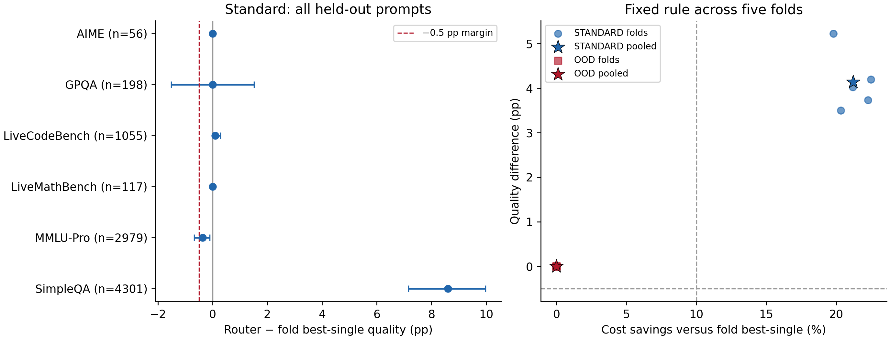
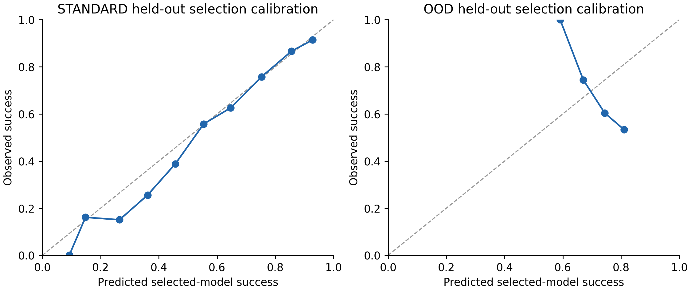

# Router v3: fixed TF-IDF robustness check

This is a robustness check on previously inspected data, **not independent confirmation**. Every prompt has one held-out decision; no C, margin, feature, seed, or policy search was performed.

**STANDARD:** 71.939% quality, 21.197% cost savings, +4.135 pp versus fold-validation best-single. All four descriptive checks pass: **True**.

**OOD:** 64.171% quality, 0.000% cost savings, +0.000 pp versus fold-validation best-single. All four descriptive checks pass: **False**.

**The standard gain survives this check; OOD routing does not.** All five non-code validation sets select Qwen as best-single. Because it is also training-cheapest, the comparative rule has no cheaper eligible model and sends every OOD prompt to Qwen. Its 64.171% code quality is far below fixed GPT-5's 86.445%. Equality with the selected Qwen reference is a trivial equality, not evidence of safe transfer or useful learned routing.

Standard gains remain concentrated in SimpleQA. Removing SimpleQA leaves 1.340% savings and -0.227 pp quality change. The result does not establish substantial cost reductions across domains.

MMLU-Pro quality decreases by -0.369 pp, with descriptive CI [-0.671, -0.101] pp. This meets the frozen dataset point guard but its interval extends below −0.5 pp. Passing the aggregate checks does not establish noninferiority independently in every domain.

The comparison evaluates the v2 selected decision rules with new, separate grouped partitions. It keeps the original v1/v2 results and canonical splits unchanged. The ten new systems are evaluation fits, and do not replace the saved v2 router.

[Protocol frozen before v3 fitting](router_v3_robustness_spec.md).

## STANDARD pooled held-out result

N=8,706; C=1; fixed comparative margin=0.02. Best-single is selected independently from each fold's validation set; its pooled result is a cross-fitted selection procedure, not one globally selected model.

| Policy | Micro quality | Mean cost USD | Dataset macro quality |
| --- | --- | --- | --- |
| router | 71.939% | $0.01475528 | 81.109% |
| best_single | 67.804% | $0.01872432 | 79.721% |
| static_gpt-5 | 67.804% | $0.01872432 | 79.721% |
| always_cheapest | 65.782% | $0.00041474 | 69.098% |
| privileged_domain_static | 70.549% | $0.01169642 | 78.228% |
| oracle | 85.527% | $0.00239740 | 89.447% |

Quality delta **+4.135 pp**, descriptive 95% CI **[+3.377, +4.824] pp**. Cost savings **21.197%**, CI **[20.194%, 22.216%]**.

Equal-dataset macro quality delta +1.388 pp, CI [+1.045, +1.720] pp. Macro cost savings 4.130%, CI [3.558%, 4.861%].

| Descriptive condition | Pass |
| --- | --- |
| dataset_point_guard | True |
| macro_interval_margin | True |
| micro_interval_margin | True |
| savings_at_least_10_percent | True |

Folds meeting the −0.5 pp point margin: 5/5. Folds saving at least 10%: 5/5. Folds overlap in training and are not independent replicates.

### Fold stability

| Fold | Fit / val / held out | Validation best | Router quality | Δ pp | Savings |
| --- | --- | --- | --- | --- | --- |
| 0 | 5571 / 1394 / 1741 | gpt-5 | 72.717% | +5.227 | 19.791% |
| 1 | 5572 / 1393 / 1741 | gpt-5 | 71.798% | +4.193 | 22.481% |
| 2 | 5572 / 1393 / 1741 | gpt-5 | 72.315% | +4.021 | 21.189% |
| 3 | 5571 / 1393 / 1742 | gpt-5 | 70.379% | +3.502 | 20.330% |
| 4 | 5572 / 1393 / 1741 | gpt-5 | 72.487% | +3.733 | 22.275% |

### Dataset outcomes

| Dataset | N | Router | Best | Δ pp | 95% Δ CI pp | Savings |
| --- | --- | --- | --- | --- | --- | --- |
| AIME | 56 | 89.286% | 89.286% | +0.000 | [+0.000, +0.000] | 0.413% |
| GPQA | 198 | 84.848% | 84.848% | +0.000 | [-1.515, +1.515] | 1.990% |
| LiveCodeBench | 1055 | 86.540% | 86.445% | +0.095 | [+0.000, +0.284] | 0.028% |
| LiveMathBench | 117 | 82.051% | 82.051% | +0.000 | [+0.000, +0.000] | 0.474% |
| MMLU-Pro | 2979 | 87.311% | 87.680% | -0.369 | [-0.671, -0.101] | 3.475% |
| SimpleQA | 4301 | 56.615% | 48.012% | +8.603 | [+7.161, +9.974] | 58.151% |

### Composition checks

| Excluded datasets | N remaining | Quality Δ pp | Savings |
| --- | --- | --- | --- |
| SimpleQA | 4405 | -0.227 | 1.340% |
| SimpleQA, MMLU-Pro | 1426 | +0.070 | 0.295% |

### Selected models

| Model | N | Share | Predicted success | Actual success | Mean cost USD |
| --- | --- | --- | --- | --- | --- |
| qwen3-235b-a22b-2507 | 2496 | 28.670% | 61.581% | 60.978% | $0.00005973 |
| intern-s1 | 20 | 0.230% | 91.067% | 60.000% | $0.00144612 |
| deepseek-v3-0324 | 21 | 0.241% | 44.186% | 42.857% | $0.00009748 |
| deepseek-r1-0528 | 49 | 0.563% | 84.354% | 73.469% | $0.01352366 |
| gemini-2.5-flash | 13 | 0.149% | 66.247% | 69.231% | $0.00261528 |
| gpt-5-chat | 73 | 0.839% | 53.141% | 41.096% | $0.00091604 |
| gpt-5 | 5988 | 68.780% | 77.734% | 77.071% | $0.02124529 |
| claude-sonnet-4 | 46 | 0.528% | 90.732% | 65.217% | $0.00650107 |

### Predictor diagnostics

| Predictor | Prevalence | ROC AUC | PR AUC | Log loss | Brier | ECE | Accuracy |
| --- | --- | --- | --- | --- | --- | --- | --- |
| qwen3-235b-a22b-2507 | 0.6578 | 0.7408 | 0.8244 | 0.5603 | 0.1887 | 0.0276 | 0.7139 |
| intern-s1 | 0.4413 | 0.8522 | 0.7930 | 0.4706 | 0.1486 | 0.0355 | 0.8082 |
| deepseek-v3-0324 | 0.5101 | 0.7847 | 0.7691 | 0.5597 | 0.1874 | 0.0218 | 0.7311 |
| deepseek-r1-0528 | 0.5542 | 0.8286 | 0.8421 | 0.4999 | 0.1620 | 0.0195 | 0.7818 |
| gemini-2.5-flash | 0.5277 | 0.7853 | 0.7900 | 0.5558 | 0.1857 | 0.0274 | 0.7371 |
| gpt-5-chat | 0.5843 | 0.7508 | 0.7930 | 0.5791 | 0.1972 | 0.0236 | 0.6904 |
| gpt-5 | 0.6780 | 0.7808 | 0.8689 | 0.5136 | 0.1707 | 0.0199 | 0.7374 |
| claude-sonnet-4 | 0.4567 | 0.8630 | 0.8210 | 0.4551 | 0.1425 | 0.0333 | 0.8176 |
| __macro__ | 0.5513 | 0.7983 | 0.8127 | 0.5243 | 0.1728 | 0.0261 | 0.7522 |
| __selected_action__ | 0.7194 | 0.7601 | 0.8729 | 0.5045 | 0.1658 | 0.0187 | 0.7571 |

The router's descriptive Pareto membership against the eight static models and fixed references is **True**. This restricted comparison is not the broader v2 policy grid. Oracle gap recovered: 23.331%; remaining quality gap: 13.588 pp. The oracle uses hindsight outcomes and realized costs and is not achievable routing performance.

Against the privileged domain-static reference, router quality changes by +1.390 pp (CI [+0.804, +1.976] pp), with -26.152% cost savings. Negative savings means the router costs more. Domain-static uses dataset names and remains a secondary reference.

## OOD pooled held-out result

N=1,055; C=1; fixed comparative margin=0.05. Best-single is selected independently from each fold's validation set; its pooled result is a cross-fitted selection procedure, not one globally selected model.

| Policy | Micro quality | Mean cost USD | Dataset macro quality |
| --- | --- | --- | --- |
| router | 64.171% | $0.00098984 | 64.171% |
| best_single | 64.171% | $0.00098984 | 64.171% |
| static_gpt-5 | 86.445% | $0.05205347 | 86.445% |
| always_cheapest | 64.171% | $0.00098984 | 64.171% |
| privileged_domain_static | 64.171% | $0.00098984 | 64.171% |
| oracle | 91.185% | $0.01323996 | 91.185% |

Quality delta **+0.000 pp**, descriptive 95% CI **[+0.000, +0.000] pp**. Cost savings **0.000%**, CI **[0.000%, 0.000%]**.

Equal-dataset macro quality delta +0.000 pp, CI [+0.000, +0.000] pp. Macro cost savings 0.000%, CI [0.000%, 0.000%].

| Descriptive condition | Pass |
| --- | --- |
| dataset_point_guard | True |
| macro_interval_margin | True |
| micro_interval_margin | True |
| savings_at_least_10_percent | False |

Folds meeting the −0.5 pp point margin: 5/5. Folds saving at least 10%: 0/5. Folds overlap in training and are not independent replicates.

### Fold stability

| Fold | Fit / val / held out | Validation best | Router quality | Δ pp | Savings |
| --- | --- | --- | --- | --- | --- |
| 0 | 4948 / 1203 / 241 | qwen3-235b-a22b-2507 | 66.390% | +0.000 | 0.000% |
| 1 | 4904 / 1208 / 202 | qwen3-235b-a22b-2507 | 64.851% | +0.000 | 0.000% |
| 2 | 4884 / 1228 / 202 | qwen3-235b-a22b-2507 | 59.901% | +0.000 | 0.000% |
| 3 | 4891 / 1225 / 207 | qwen3-235b-a22b-2507 | 67.150% | +0.000 | 0.000% |
| 4 | 4872 / 1241 / 203 | qwen3-235b-a22b-2507 | 62.069% | +0.000 | 0.000% |

### Dataset outcomes

| Dataset | N | Router | Best | Δ pp | 95% Δ CI pp | Savings |
| --- | --- | --- | --- | --- | --- | --- |
| LiveCodeBench | 1055 | 64.171% | 64.171% | +0.000 | [+0.000, +0.000] | 0.000% |

### Composition checks

| Excluded datasets | N remaining | Quality Δ pp | Savings |
| --- | --- | --- | --- |
| SimpleQA | 1055 | +0.000 | 0.000% |
| SimpleQA, MMLU-Pro | 1055 | +0.000 | 0.000% |

### Selected models

| Model | N | Share | Predicted success | Actual success | Mean cost USD |
| --- | --- | --- | --- | --- | --- |
| qwen3-235b-a22b-2507 | 1055 | 100.000% | 72.519% | 64.171% | $0.00098984 |
| intern-s1 | 0 | 0.000% | — | — | — |
| deepseek-v3-0324 | 0 | 0.000% | — | — | — |
| deepseek-r1-0528 | 0 | 0.000% | — | — | — |
| gemini-2.5-flash | 0 | 0.000% | — | — | — |
| gpt-5-chat | 0 | 0.000% | — | — | — |
| gpt-5 | 0 | 0.000% | — | — | — |
| claude-sonnet-4 | 0 | 0.000% | — | — | — |

### Predictor diagnostics

| Predictor | Prevalence | ROC AUC | PR AUC | Log loss | Brier | ECE | Accuracy |
| --- | --- | --- | --- | --- | --- | --- | --- |
| qwen3-235b-a22b-2507 | 0.6417 | 0.4101 | 0.5879 | 0.6912 | 0.2454 | 0.1280 | 0.6417 |
| intern-s1 | 0.4919 | 0.4092 | 0.4210 | 0.7342 | 0.2697 | 0.1044 | 0.4720 |
| deepseek-v3-0324 | 0.6664 | 0.4533 | 0.6334 | 0.6715 | 0.2392 | 0.0997 | 0.6180 |
| deepseek-r1-0528 | 0.8009 | 0.4264 | 0.7690 | 0.5527 | 0.1820 | 0.1243 | 0.8000 |
| gemini-2.5-flash | 0.6000 | 0.4258 | 0.5470 | 0.6938 | 0.2496 | 0.0849 | 0.5953 |
| gpt-5-chat | 0.6218 | 0.4185 | 0.5666 | 0.6835 | 0.2445 | 0.0774 | 0.6161 |
| gpt-5 | 0.8645 | 0.3700 | 0.8167 | 0.4449 | 0.1336 | 0.1171 | 0.8645 |
| claude-sonnet-4 | 0.5810 | 0.4402 | 0.5453 | 0.7000 | 0.2530 | 0.0932 | 0.5545 |
| __macro__ | 0.6585 | 0.4192 | 0.6109 | 0.6465 | 0.2271 | 0.1036 | 0.6453 |
| __selected_action__ | 0.6417 | 0.4101 | 0.5879 | 0.6912 | 0.2454 | 0.1280 | 0.6417 |

The router's descriptive Pareto membership against the eight static models and fixed references is **True**. This restricted comparison is not the broader v2 policy grid. Oracle gap recovered: 0.000%; remaining quality gap: 27.014 pp. The oracle uses hindsight outcomes and realized costs and is not achievable routing performance.

Against the privileged domain-static reference, router quality changes by +0.000 pp (CI [+0.000, +0.000] pp), with 0.000% cost savings. Negative savings means the router costs more. Domain-static uses dataset names and remains a secondary reference.

## Matched code generalization

The same 1,055 code prompts receive one standard and one OOD held-out prediction. Standard quality is 86.540%; OOD is 64.171%. OOD − standard is -22.370 pp, descriptive CI [-25.118, -19.621] pp. OOD cost savings relative to standard: 98.098%.

Both systems use matched outer partitions, but their training domains and fixed routing margins differ. This is a paired comparison of two fixed algorithms, not an isolated causal effect of code training.

The OOD failure exposes reference-selection risk: conservative downgrading relative to a weak source-validation reference cannot protect quality on an unseen domain. V2's particular non-code validation split selected GPT-5, producing 86.351% code quality with 1.129% savings. Here all five validation choices select Qwen. Neither result is replaced, and no post-hoc switch to GPT-5 is made.





## Limits and next step

These new partitions expand evaluation coverage to all 56 AIME, 117 LiveMathBench, 198 GPQA, 1,055 LiveCodeBench, 2,979 MMLU-Pro and 4,301 SimpleQA prompts. They do not add independent evidence after earlier benchmark-guided research. The original frozen standard/OOD results remain the v2 results.

Each standard fit uses approximately 64% of the benchmark, with 16% validation and 20% evaluation. OOD removes all code from those fitting and validation partitions and evaluates only held-out code. These training sets are smaller than the canonical v2 fits. Fold ranges expose sensitivity without treating overlapping fits as independent experiments.

All intervals use 2,000 seed-3407 paired whole-group resamples within dataset strata, conditional on the fixed fitted models and decisions. They omit refitting uncertainty, cross-fold dependence from shared training observations, and prior adaptation to this benchmark. Passing the numerical margin therefore provides descriptive support only. Identical actions yield zero empirical variance, which does not prove a population bound on unseen failures. No bootstrap retraining or post-result policy selection occurs.

The next confirmation must use unseen complete prompt-model outcomes with the router, comparator, cost accounting, and acceptance criteria frozen beforehand. Within this benchmark, inspect the domain and composition results rather than searching more margins or seeds until every check passes.

Before an OOD deployment claim, specify a separate experiment for reference selection under domain shift, using only source-domain validation for decisions and an explicit deployment-quality reference. Preserve an untouched final domain for confirmation. This audit does not implement that next experiment.

## Artifacts, checks, and reproduction

Every fold saves its model, training-only vocabulary/costs, validation reference choices, label-free predictions/actions, and separate outcomes. Pooled predictions, evaluation rows, all static points, calibration data, model-by-dataset counts and 2,000-replicate samples are retained. The campaign hashes original processed files, prior reports, source snapshots and all output artifacts. Full first-fold training replay in each regime and saved model reloads match exactly. Networking is blocked.

From an unused output directory:

```bash
.venv/bin/python experiments/crossfit_tfidf_router.py
.venv/bin/python tests/run_offline_suite.py
```

To preserve completed artifacts when replaying:

```bash
router_check_dir=$(mktemp -d /tmp/router-v3-replay.XXXXXX)
.venv/bin/python experiments/crossfit_tfidf_router.py --output-dir "$router_check_dir" --reports-dir "$router_check_dir/reports"
```

Regenerate this report with `.venv/bin/python experiments/crossfit_tfidf_router.py --report-only`. The original processed artifacts and v1/v2 reports are unchanged.

Full offline suite: **225 tests; 0 failures, 0 errors, 0 skipped; 0 network attempts**. [Test summary](router_v3_tests.json).
