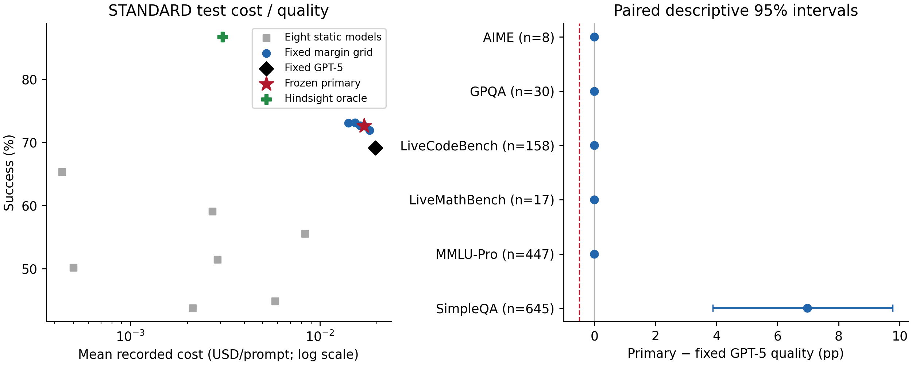
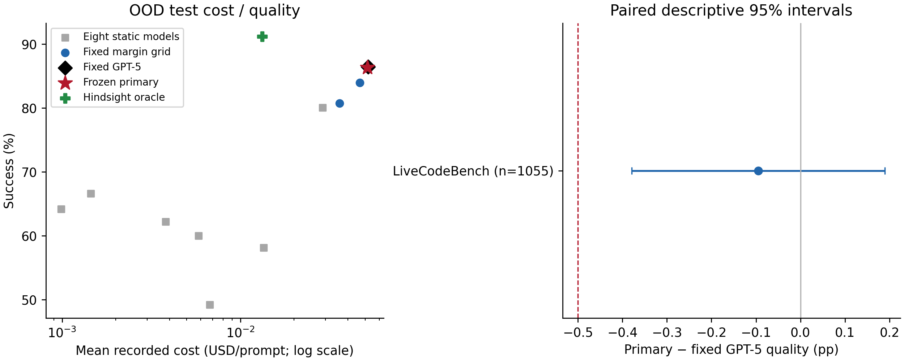
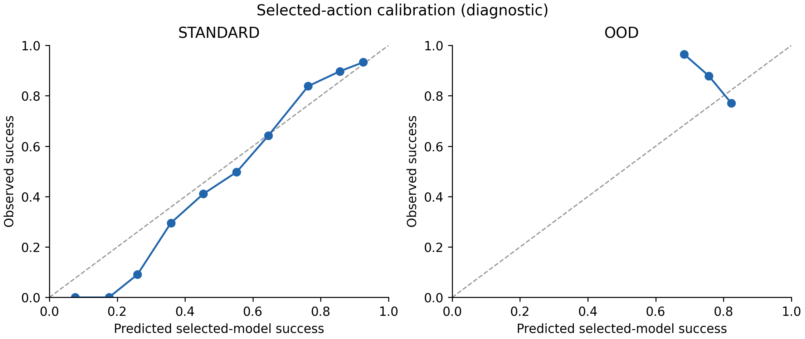

# Router v4: fixed GPT-5 reference and source-domain validation

**STANDARD:** frozen primary `advantage_0.10` achieves **72.567% quality**, **12.570% cost savings**, and **+3.448 pp** versus fixed GPT-5. Meets all four declared meaningful-routing criteria: **True**.

**OOD:** frozen primary `advantage_0.05` achieves **86.351% quality**, **1.129% cost savings**, and **-0.095 pp** versus fixed GPT-5. Meets all four declared meaningful-routing criteria: **False**.

These are exploratory results on already-inspected benchmark outcomes. Fixing the reference prevents source validation from weakening the quality target, but does not establish independent confirmation. The source-domain checks affect validation selection only. No test point replaces either frozen primary.

[Protocol written before fitting](router_v4_experiment_spec.md). V1, v2, v3 and the processed data remain unchanged. The reference is the benchmark model `gpt-5`; no GPT-5.6 Sol outcomes are present.

The standard result clears the previous observed code-quality loss by selecting a more conservative margin from validation evidence. Its 0.10 margin retains GPT-5 for all standard test math, science and code prompts. All 45 additional successes occur in SimpleQA; removing SimpleQA leaves 0.283% savings. This supports a QA-focused cost reduction, not broad domain-independent savings.

OOD still fails the declared 10% savings criterion. Its 0.05 margin gives exactly the same code decisions as v2's OOD primary: 1,030 GPT-5 and 25 Qwen. The stable reference removes v3's source-validation reference failure, but this campaign does not improve cost-saving transfer to code.

## STANDARD test

C=1; primary `advantage_0.10`. Fixed reference: GPT-5. Validation-selected best-single (secondary reference): `gpt-5`.

| Policy | Quality | Cost USD/prompt | Dataset macro quality |
| --- | --- | --- | --- |
| primary | 72.567% | $0.01716859 | 85.887% |
| fixed_gpt5 | 69.119% | $0.01963688 | 84.724% |
| validation_best_single | 69.119% | $0.01963688 | 84.724% |
| always_cheapest | 65.287% | $0.00043555 | 67.854% |
| oracle | 86.667% | $0.00307040 | 91.684% |

Quality delta **+3.448 pp**, paired 95% CI **[+1.914, +4.906] pp**. Cost savings **12.570%**, CI **[10.690%, 14.434%]**.

Equal-dataset macro quality delta +1.163 pp, CI [+0.645, +1.654] pp. Macro cost savings 2.162%, CI [1.645%, 2.894%].

| Declared criterion | Pass |
| --- | --- |
| dataset_point_guard | True |
| macro_noninferiority | True |
| micro_noninferiority | True |
| savings_at_least_10_percent | True |

Additional check: every dataset's individual test interval lower bound is at least −0.5 pp: **True**. The declared dataset criterion above uses point differences; these two conditions are reported separately.

### Frozen controls

| Policy | Validation choice | Quality | Cost USD | Savings | Δ pp | 95% Δ CI pp |
| --- | --- | --- | --- | --- | --- | --- |
| fixed_margin_control | advantage_0.02 | 73.103% | $0.01530374 | 22.066% | +3.985 | [+2.069, +5.824] |
| ordinary_only_control | advantage_0.05 | 72.644% | $0.01628367 | 17.076% | +3.525 | [+1.762, +5.287] |
| primary | advantage_0.10 | 72.567% | $0.01716859 | 12.570% | +3.448 | [+1.914, +4.906] |

### Validation selection audit

Joint bootstrap critical value: 2.6847; ordinary-validation-only critical value: 2.5140. 3/6 candidates pass all ordinary/source-domain bounds.

| Candidate | Validation quality | Cost USD | Worst joint lower pp | Joint feasible | Ordinary-only feasible |
| --- | --- | --- | --- | --- | --- |
| advantage_0.00 | 72.150% | $0.01279639 | -12.346 | False | False |
| advantage_0.02 | 72.686% | $0.01392261 | -5.500 | False | False |
| advantage_0.05 | 72.073% | $0.01480582 | -0.776 | False | True |
| advantage_0.10 | 71.538% | $0.01580205 | +0.000 | True | True |
| advantage_0.20 | 70.926% | $0.01670838 | +0.000 | True | True |
| fixed_gpt5 | 67.865% | $0.01779838 | +0.000 | True | True |

| Candidate | Most limiting block | Metric/domain | Observed Δ pp | Joint lower pp |
| --- | --- | --- | --- | --- |
| advantage_0.00 | ordinary | gpqa | -3.333 | -12.346 |
| advantage_0.02 | source_holdout | livecodebench | -3.518 | -5.500 |
| advantage_0.05 | source_holdout | livecodebench | -0.135 | -0.776 |
| advantage_0.10 | ordinary | aime | +0.000 | +0.000 |
| advantage_0.20 | ordinary | aime | +0.000 | +0.000 |
| fixed_gpt5 | ordinary | __micro__ | +0.000 | +0.000 |

The selected primary's behavior on domains excluded from auxiliary training is shown below. Near-total fallback explains zero observed quality-difference variance; these checks do not demonstrate cost-saving specialization on unseen domains.

| Source holdout | N | Routed to GPT-5 | Cost savings |
| --- | --- | --- | --- |
| All source holdouts | 6094 | 100.000% | 0.000% |
| AIME | 39 | 100.000% | 0.000% |
| GPQA | 138 | 100.000% | 0.000% |
| LiveCodeBench | 739 | 100.000% | 0.000% |
| LiveMathBench | 82 | 100.000% | 0.000% |
| MMLU-Pro | 2085 | 100.000% | 0.000% |
| SimpleQA | 3011 | 100.000% | 0.000% |

### Dataset outcomes

| Dataset | N | Primary quality | Δ vs GPT-5 pp | 95% Δ CI pp | Savings |
| --- | --- | --- | --- | --- | --- |
| AIME | 8 | 100.000% | +0.000 | [+0.000, +0.000] | 0.000% |
| GPQA | 30 | 86.667% | +0.000 | [+0.000, +0.000] | 0.000% |
| LiveCodeBench | 158 | 89.873% | +0.000 | [+0.000, +0.000] | 0.000% |
| LiveMathBench | 17 | 94.118% | +0.000 | [+0.000, +0.000] | 0.000% |
| MMLU-Pro | 447 | 89.933% | +0.000 | [+0.000, +0.000] | 0.798% |
| SimpleQA | 645 | 54.729% | +6.977 | [+3.876, +9.767] | 36.579% |

| Excluded from micro evaluation | N remaining | Δ pp | Savings |
| --- | --- | --- | --- |
| SimpleQA | 660 | +0.000 | 0.283% |
| SimpleQA, MMLU-Pro | 213 | +0.000 | 0.000% |

### Selected-model behavior

| Model | N | Share | Mean prediction | Actual success | Mean cost USD |
| --- | --- | --- | --- | --- | --- |
| qwen3-235b-a22b-2507 | 246 | 18.851% | 65.219% | 64.228% | $0.00004999 |
| intern-s1 | 0 | 0.000% | — | — | — |
| deepseek-v3-0324 | 0 | 0.000% | — | — | — |
| deepseek-r1-0528 | 0 | 0.000% | — | — | — |
| gemini-2.5-flash | 0 | 0.000% | — | — | — |
| gpt-5-chat | 1 | 0.077% | 63.301% | 100.000% | $0.00019125 |
| gpt-5 | 1057 | 80.996% | 73.419% | 74.551% | $0.02117755 |
| claude-sonnet-4 | 1 | 0.077% | 70.236% | 0.000% | $0.00784500 |

### Predictor diagnostics

| Predictor | Prevalence | ROC AUC | PR AUC | Log loss | Brier | ECE | Accuracy |
| --- | --- | --- | --- | --- | --- | --- | --- |
| qwen3-235b-a22b-2507 | 0.6529 | 0.7463 | 0.8358 | 0.5627 | 0.1905 | 0.0470 | 0.7103 |
| intern-s1 | 0.4375 | 0.8491 | 0.8004 | 0.4736 | 0.1507 | 0.0318 | 0.8015 |
| deepseek-v3-0324 | 0.5019 | 0.7990 | 0.7868 | 0.5465 | 0.1823 | 0.0242 | 0.7441 |
| deepseek-r1-0528 | 0.5556 | 0.8294 | 0.8462 | 0.4986 | 0.1619 | 0.0206 | 0.7801 |
| gemini-2.5-flash | 0.5142 | 0.7992 | 0.7961 | 0.5442 | 0.1813 | 0.0338 | 0.7441 |
| gpt-5-chat | 0.5908 | 0.7549 | 0.8049 | 0.5731 | 0.1950 | 0.0267 | 0.6996 |
| gpt-5 | 0.6912 | 0.8006 | 0.8903 | 0.4869 | 0.1597 | 0.0338 | 0.7533 |
| claude-sonnet-4 | 0.4483 | 0.8612 | 0.8205 | 0.4570 | 0.1443 | 0.0409 | 0.8100 |
| __macro__ | 0.5490 | 0.8050 | 0.8226 | 0.5178 | 0.1707 | 0.0323 | 0.7554 |
| __selected_action__ | 0.7257 | 0.7864 | 0.8954 | 0.4797 | 0.1564 | 0.0392 | 0.7655 |

Primary is on the descriptive test Pareto frontier among this fixed grid and static references: **False**. Oracle gap recovered: 19.651%; remaining gap: 14.100 pp. The oracle uses realized outcomes/costs and is not achievable performance.



## OOD test

C=1; primary `advantage_0.05`. Fixed reference: GPT-5. Validation-selected best-single (secondary reference): `gpt-5`.

| Policy | Quality | Cost USD/prompt | Dataset macro quality |
| --- | --- | --- | --- |
| primary | 86.351% | $0.05146555 | 86.351% |
| fixed_gpt5 | 86.445% | $0.05205347 | 86.445% |
| validation_best_single | 86.445% | $0.05205347 | 86.445% |
| always_cheapest | 64.171% | $0.00098984 | 64.171% |
| oracle | 91.185% | $0.01323996 | 91.185% |

Quality delta **-0.095 pp**, paired 95% CI **[-0.379, +0.190] pp**. Cost savings **1.129%**, CI **[0.498%, 1.908%]**.

Equal-dataset macro quality delta -0.095 pp, CI [-0.379, +0.190] pp. Macro cost savings 1.129%, CI [0.498%, 1.908%].

| Declared criterion | Pass |
| --- | --- |
| dataset_point_guard | True |
| macro_noninferiority | True |
| micro_noninferiority | True |
| savings_at_least_10_percent | False |

Additional check: every dataset's individual test interval lower bound is at least −0.5 pp: **True**. The declared dataset criterion above uses point differences; these two conditions are reported separately.

### Frozen controls

| Policy | Validation choice | Quality | Cost USD | Savings | Δ pp | 95% Δ CI pp |
| --- | --- | --- | --- | --- | --- | --- |
| fixed_margin_control | advantage_0.05 | 86.351% | $0.05146555 | 1.129% | -0.095 | [-0.379, +0.190] |
| ordinary_only_control | advantage_0.05 | 86.351% | $0.05146555 | 1.129% | -0.095 | [-0.379, +0.190] |
| primary | advantage_0.05 | 86.351% | $0.05146555 | 1.129% | -0.095 | [-0.379, +0.190] |

### Validation selection audit

Joint bootstrap critical value: 2.7109; ordinary-validation-only critical value: 2.1675. 4/6 candidates pass all ordinary/source-domain bounds.

| Candidate | Validation quality | Cost USD | Worst joint lower pp | Joint feasible | Ordinary-only feasible |
| --- | --- | --- | --- | --- | --- |
| advantage_0.00 | 70.906% | $0.00785001 | -11.907 | False | False |
| advantage_0.02 | 71.777% | $0.00887556 | -2.260 | False | False |
| advantage_0.05 | 72.387% | $0.00983434 | +0.000 | True | True |
| advantage_0.10 | 71.254% | $0.01109532 | +0.000 | True | True |
| advantage_0.20 | 70.383% | $0.01258610 | +0.000 | True | True |
| fixed_gpt5 | 66.202% | $0.01381472 | +0.000 | True | True |

| Candidate | Most limiting block | Metric/domain | Observed Δ pp | Joint lower pp |
| --- | --- | --- | --- | --- |
| advantage_0.00 | source_holdout | gpqa | -5.357 | -11.907 |
| advantage_0.02 | source_holdout | gpqa | +0.000 | -2.260 |
| advantage_0.05 | ordinary | aime | +0.000 | +0.000 |
| advantage_0.10 | ordinary | aime | +0.000 | +0.000 |
| advantage_0.20 | ordinary | aime | +0.000 | +0.000 |
| fixed_gpt5 | ordinary | __micro__ | +0.000 | +0.000 |

The selected primary's behavior on domains excluded from auxiliary training is shown below. Near-total fallback explains zero observed quality-difference variance; these checks do not demonstrate cost-saving specialization on unseen domains.

| Source holdout | N | Routed to GPT-5 | Cost savings |
| --- | --- | --- | --- |
| All source holdouts | 6503 | 99.954% | 0.002% |
| AIME | 48 | 100.000% | 0.000% |
| GPQA | 168 | 98.810% | -0.018% |
| LiveMathBench | 99 | 100.000% | 0.000% |
| MMLU-Pro | 2532 | 99.961% | 0.012% |
| SimpleQA | 3656 | 100.000% | 0.000% |

### Dataset outcomes

| Dataset | N | Primary quality | Δ vs GPT-5 pp | 95% Δ CI pp | Savings |
| --- | --- | --- | --- | --- | --- |
| LiveCodeBench | 1055 | 86.351% | -0.095 | [-0.379, +0.190] | 1.129% |

| Excluded from micro evaluation | N remaining | Δ pp | Savings |
| --- | --- | --- | --- |
| SimpleQA | 1055 | -0.095 | 1.129% |
| SimpleQA, MMLU-Pro | 1055 | -0.095 | 1.129% |

### Selected-model behavior

| Model | N | Share | Mean prediction | Actual success | Mean cost USD |
| --- | --- | --- | --- | --- | --- |
| qwen3-235b-a22b-2507 | 25 | 2.370% | 78.743% | 88.000% | $0.00060376 |
| intern-s1 | 0 | 0.000% | — | — | — |
| deepseek-v3-0324 | 0 | 0.000% | — | — | — |
| deepseek-r1-0528 | 0 | 0.000% | — | — | — |
| gemini-2.5-flash | 0 | 0.000% | — | — | — |
| gpt-5-chat | 0 | 0.000% | — | — | — |
| gpt-5 | 1030 | 97.630% | 76.441% | 86.311% | $0.05270006 |
| claude-sonnet-4 | 0 | 0.000% | — | — | — |

### Predictor diagnostics

| Predictor | Prevalence | ROC AUC | PR AUC | Log loss | Brier | ECE | Accuracy |
| --- | --- | --- | --- | --- | --- | --- | --- |
| qwen3-235b-a22b-2507 | 0.6417 | 0.4060 | 0.5781 | 0.7031 | 0.2493 | 0.1280 | 0.6417 |
| intern-s1 | 0.4919 | 0.4090 | 0.4262 | 0.7311 | 0.2683 | 0.1050 | 0.4692 |
| deepseek-v3-0324 | 0.6664 | 0.4675 | 0.6464 | 0.6779 | 0.2424 | 0.1207 | 0.5839 |
| deepseek-r1-0528 | 0.8009 | 0.4515 | 0.7842 | 0.5536 | 0.1825 | 0.1339 | 0.8009 |
| gemini-2.5-flash | 0.6000 | 0.4291 | 0.5517 | 0.6909 | 0.2484 | 0.0855 | 0.5972 |
| gpt-5-chat | 0.6218 | 0.3968 | 0.5507 | 0.6900 | 0.2477 | 0.0957 | 0.6123 |
| gpt-5 | 0.8645 | 0.3619 | 0.8101 | 0.4456 | 0.1337 | 0.1213 | 0.8645 |
| claude-sonnet-4 | 0.5810 | 0.4314 | 0.5356 | 0.7007 | 0.2534 | 0.0849 | 0.5545 |
| __macro__ | 0.6585 | 0.4192 | 0.6104 | 0.6491 | 0.2282 | 0.1094 | 0.6405 |
| __selected_action__ | 0.8635 | 0.3689 | 0.8095 | 0.4455 | 0.1337 | 0.1181 | 0.8635 |

Primary is on the descriptive test Pareto frontier among this fixed grid and static references: **True**. Oracle gap recovered: -2.000%; remaining gap: 4.834 pp. The oracle uses realized outcomes/costs and is not achievable performance.



## Matched code comparison

On the shared 158 code test prompts, standard quality is 89.873% and OOD quality is 89.873%. OOD − standard is +0.000 pp with paired CI [+0.000, +0.000] pp. Full OOD quality over 1,055 prompts is 86.351%. Training domains differ; the full standard and OOD code test populations also differ.



## What this experiment establishes

The quality target is stable: every routing rule falls back to the same predefined GPT-5 reference. The ordinary-only and fixed-margin controls distinguish this reference choice from the effect of requiring validation evidence on source domains excluded from auxiliary training. A static fallback has zero routing savings and cannot count as a successful learned router.

Selection bounds cover all six policies, ordinary validation, held-out source validation, micro/macro quality, and each dataset. These are approximate conditional bootstrap bounds. Auxiliary training sets overlap; their shared fitting uncertainty is not estimated. Zero observed variance gives zero empirical width, not a guarantee about unseen failures. Test intervals also condition on fixed fits/selection. The benchmark has already influenced earlier research choices, so passing numerical checks is exploratory.

Source-domain validation can reject a useful tradeoff when the model cannot generalize that tradeoff to a withheld source domain. This is an intended test of transfer evidence, not permission to remove a failed domain or weaken a constraint after seeing outcomes. The per-domain and composition tables show whether savings are distributed across tasks or concentrated in knowledge QA.

Further tuning on these same tests cannot supply independent confirmation. The next claim about deployment should use unseen complete outcomes, with the reference and evaluation criteria fixed first. No new data acquisition, paid evaluation, provider work, or additional model search occurs here.

## Reproduction and local inference

The final and auxiliary fits are independent, training-only TF-IDF/logistic models with C=1. Final fits replay exactly in each regime; saved models reproduce predictions. Training costs, memberships, vocabularies, candidate ordering, validation grids/bounds, policy choices, all predictions/actions, separate outcomes, bootstrap samples, diagnostics, source snapshots and hashes are retained under `artifacts/router_v4/`. Original processed-data and v1/v2/v3 report hashes remain unchanged.

Run into an unused directory to preserve completed experiments:

```bash
router_run_dir=$(mktemp -d /tmp/router-v4-replay.XXXXXX)
.venv/bin/python experiments/fixed_reference_router.py --output-dir "$router_run_dir" --reports-dir "$router_run_dir/reports"
.venv/bin/python tests/run_offline_suite.py
```

Route new prompt text through the frozen primary locally:

```bash
.venv/bin/python experiments/route_local.py --artifact-dir artifacts/router_v4/standard --prompt 'What is the capital of France?'
.venv/bin/python experiments/route_local.py --artifact-dir artifacts/router_v4/ood --prompt 'Write a function that finds the median of two sorted arrays.'
```

These commands choose a benchmark model; they do not call it. Regenerate reports using `.venv/bin/python experiments/fixed_reference_router.py --report-only`.

Full offline suite: **237 tests, 0 failures, 0 errors, 0 skipped; 0 network attempts**. [Test result](router_v4_tests.json).
